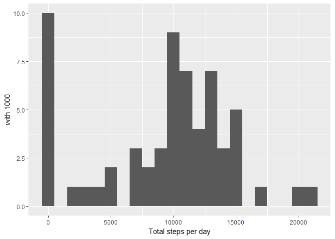
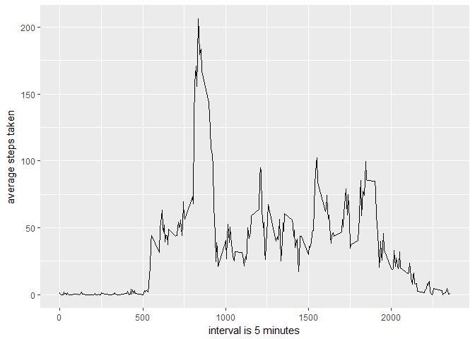
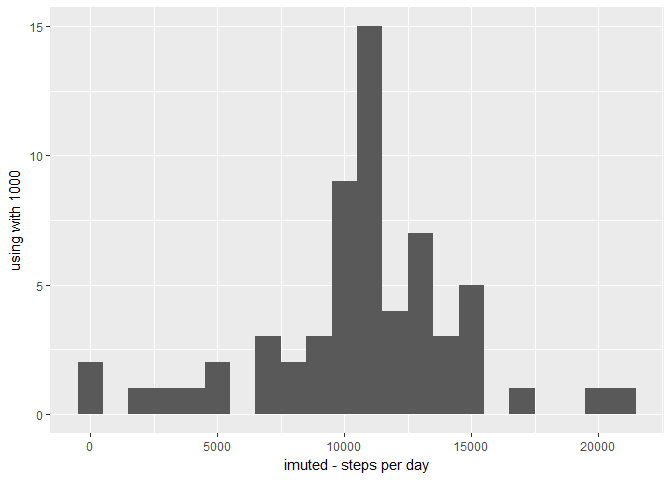
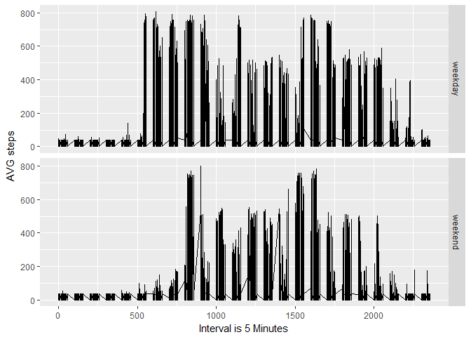

Loading the data
----------------

1.  Load the .csv file

<!-- -->

    unzip(zipfile = "activity.zip")

    ## Warning in unzip(zipfile = "activity.zip"): Fehler 1 während des
    ## Extrahierens aus Zipfile

    initialload <- read.csv("activity.csv")

install.packages("Hmisc") install.packages("ggplot2") library(ggplot2)
library(Hmisc)

Mean total number of steps taken per day
----------------------------------------

    daily_steps <- tapply(initialload$steps, initialload$date, sum, na.rm=T)

1.  Histogram - total number of steps taken per day

<!-- -->

    library(ggplot2)
    library(Hmisc)

    ## Loading required package: lattice

    ## Loading required package: survival

    ## Loading required package: Formula

    ## 
    ## Attaching package: 'Hmisc'

    ## The following objects are masked from 'package:base':
    ## 
    ##     format.pval, round.POSIXt, trunc.POSIXt, units

    library(scales)

    qplot(daily_steps, xlab='Total steps per day', ylab='with 1000', binwidth=1000)

1.  Mean and median of steps taken per day

<!-- -->

    mean_steps <- mean(daily_steps)
    median_steps <- median(daily_steps)

Mean: 9354.2295082

Median: 10395

Daily activity pattern
----------------------

    avg_per_time <- aggregate(x=list(mean_steps=initialload$steps),
                              by=list(interval=initialload$interval), 
                              FUN=mean, 
                              na.rm=TRUE
                              )

1.  Plot - time series

<!-- -->

    ggplot(data=avg_per_time, aes(x=interval, y=mean_steps)) +
        geom_line() +
        xlab("interval is 5 minutes") +
        ylab("average steps taken") 

1.  the 5 minute interval, which contains the max number of steps across
    the dataset.

<!-- -->

    max_steps <- which.max(avg_per_time$mean_steps)
    max_steps_t <- gsub("([0-9]{1,2})([0-9]{2})", "\\1:\\2",avg_per_time[max_steps,'interval'])

Max steps at: 8:35 o'clock.

Input of missing values
-----------------------

1.  report the total number of missing values.

<!-- -->

    missing_values <- length(which(is.na(initialload$steps)))

The number of missing values is 2304.

1.  Strategy to fill in missing values? -&gt; floor should be fine -
    alternativ "If in doubt, leave it out"

2.  New Dataset which is equal to the orginal, NA need to be filled.

<!-- -->

    library(ggplot2)
    library(scales)
    library(Hmisc)
    initl <- initialload
    initl$steps <- impute(initialload$steps, fun=mean)

1.  Histogram - total number of steps taken each day

<!-- -->

    imutedsteps <- tapply(initl$steps, initl$date, sum)
    qplot(imutedsteps, xlab='imuted - steps per day', ylab='using with 1000', binwidth=1000)

Calculate and report median and mean of total steps taken per day.

    reinitmean <- mean(imutedsteps)
    reinitmedian <- median(imutedsteps)

Mean(floor):1.076618910^{4}

Median(floor):1.076618910^{4}

Activity differences between Weekends and weekdays
--------------------------------------------------

1.  Create a new factor variable in the dataset with two levels –
    “weekday” and “weekend” indicating whether a given date is a weekday
    or weekend day.

<!-- -->

    initl$dateType <- ifelse(as.POSIXlt(initl$date)$wday %in% c(0,5), 
                             'weekend', 
                             'weekday')

1.  Make a panel plot containing a time series plot (i.e. type = "l") of
    the 5-minute interval (x-axis) and the average number of steps
    taken, averaged across all weekday days or weekend days (y-axis).

<!-- -->

    avginitl <- aggregate(steps ~ interval + dateType, data=initl, mean)
    ggplot(initl, aes(interval, steps)) + 
        geom_line() + 
        facet_grid(dateType ~ .) +
        xlab("Interval is 5 Minutes") + 
        ylab("AVG steps")

    ## Don't know how to automatically pick scale for object of type impute. Defaulting to continuous.

